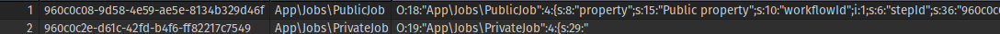

A basic repo to check if serialization works as expected.

An example dockerfile is included. Didn't had much time to refine the script so need to do some manual labor, so sorry about that.

```
docker build -t serialize-test .

docker run -it serialize-test /bin/bash

service postgresql start

su - postgres

psql

CREATE DATABASE example;
ALTER USER postgres PASSWORD 'password';
\q

exit

php artisan test
```

There are 2 tests;

First one is:

`correct serialization for private field` that uses App\Workflows\PrivateWorkflow and App\Jobs\PrivateJob to check private field serialization which fails.

Second one is:

`correct serialization for public field` that uses App\Workflows\PublicWorkflow and App\Jobs\PublicJob to having a public field causes any problems, which it isn't.

An example of the output.

table=>workflow_jobs

